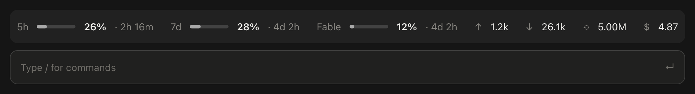

# Claude Code Usage Bar

A one-line usage bar above the Claude Code prompt. It keeps your plan limits in view (the 5-hour window, the weekly window, and per-model weekly limits such as Fable), each with its reset countdown, next to the tokens and cost of the current session.



## What it shows

| Item | Meaning |
| --- | --- |
| `5h ▬ 26% · 2h 16m` | 5-hour plan limit: share used, time until it resets |
| `7d ▬ 28% · 4d 2h` | Weekly limit across all models |
| `Fable ▬ 12% · 4d 2h` | A per-model weekly limit, shown when your plan has one |
| `↑ 1.2k` | Input tokens this session (the part not served from the prompt cache) |
| `↓ 26.1k` | Output tokens this session |
| `⟲ 5.00M` | Prompt-cache tokens this session (read + written) |
| `$ 4.87` | Session cost at API prices, the same figure `/cost` shows |

The bar stays on a single line at any width. When space runs out it drops the least useful parts first: the per-model countdown, the weekly countdown, cache, input and output tokens, the 5-hour countdown, then cost. The bars and percentages always stay.

## Install

You need Claude Code **2.1.287 or newer**; mods are on by default from that version.

Run these two commands in a terminal:

```bash
claude plugin marketplace add MuratKaragozgil/claude-code-usage-bar
claude plugin install usage-bar@claude-code-usage-bar
```

Then start a new Claude Code session. The bar appears above the prompt, in the terminal and in the Code tab of the Claude desktop app.

You can also install from inside a terminal Claude Code session:

```text
/plugin marketplace add MuratKaragozgil/claude-code-usage-bar
/plugin install usage-bar@claude-code-usage-bar
/reload-plugins
```

## Use

There is nothing to configure. Type `/usage-bar` to hide the bar, and again to bring it back.

The plan limits need a claude.ai login (Pro, Max, Team or Enterprise). Signed in with an API key, the bar shows tokens and cost only.

## Update or remove

```bash
claude plugin marketplace update claude-code-usage-bar
claude plugin update usage-bar@claude-code-usage-bar
```

```bash
claude plugin uninstall usage-bar@claude-code-usage-bar
claude plugin marketplace remove claude-code-usage-bar
```

## How it works

The plugin is a [Claude Code mod](https://claude.dev/blog/getting-started-with-claude-code-mods/): one TypeScript module of function hooks, [`register.tsx`](plugins/usage-bar/hooks/register.tsx).

- `session.measure` delivers the 5-hour and weekly windows and the session cost after every response, as Claude Code's own status line reads them.
- `turn.complete` adds up each turn's token counts, subagents included.
- Per-model weekly limits are not in the API's rate-limit headers, so the plugin reads them from the usage endpoint behind the desktop app's usage card and `/usage`.
- `ui.render` on the `AbovePrompt` site draws the row: SVG bars on the desktop, text bars in the terminal.

### Privacy

The plugin makes one kind of network request: `GET https://api.anthropic.com/api/oauth/usage`. It goes out when a session starts, every five minutes, and when a limit moves, at most once a minute. The request carries Claude Code's own credential through `$.session.authorize()`. That call returns an opaque handle, so your token never reaches the plugin. Nothing is sent anywhere else.

The endpoint is undocumented and may change. If it fails, the 5-hour and weekly bars keep working from the session's own data, and a single line in the transcript says why the per-model limits are missing.

## Development

```bash
git clone https://github.com/MuratKaragozgil/claude-code-usage-bar
cd claude-code-usage-bar
claude --plugin-dir ./plugins/usage-bar        # load it from disk for one session
claude plugin validate --strict ./plugins/usage-bar
claude plugin test ./plugins/usage-bar
```

The tests mount the band on the terminal and desktop surfaces, with the usage endpoint answering and refusing, at a wide and a narrow width.

```text
.claude-plugin/marketplace.json      makes this repository a plugin marketplace
plugins/usage-bar/
  .claude-plugin/plugin.json         the plugin manifest
  hooks/hooks.json                   points Claude Code at the module
  hooks/register.tsx                 the whole mod
  types/index.d.ts                   the types of the values it keeps in $.state
  tests/render.test.ts               claude plugin test suite
```

## License

[MIT](LICENSE). This is a community project, not affiliated with or endorsed by Anthropic.
